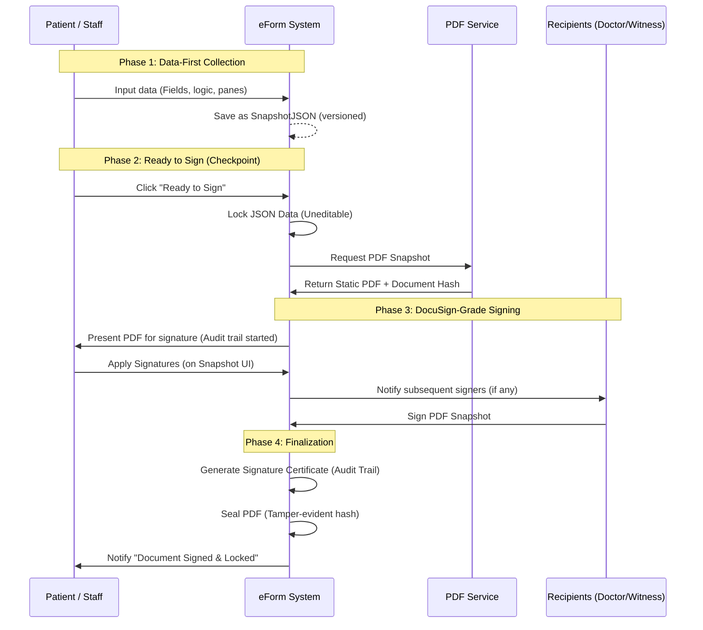

# Refined Multi-Recipient Signing (Data-First Approach)

This document outlines the architecture for a "Data-First" signing workflow, where the eForm dataset is collected first, and a PDF snapshot serves as the integrity anchor for e-signatures.

## Technical Philosophy
- **Operational Truth**: JSON dataset (for prefill, mapping, EHR ingestion).
- **Legal Truth**: Signed PDF snapshot (for integrity, compliance, and sharing).
- **Integrity Anchor**: A document snapshot created at the "Ready to Sign" moment.

---

## 1. The Signing Lifecycle

The submission state moves through the following phases:

| State | Action | Outcome |
| :--- | :--- | :--- |
| **Draft / Filling** | Patient/Staff fills the HTML form. | Interactive logic active, data stored as JSON. |
| **Ready to Sign** | User clicks "Ready to Sign" (Checkpoint). | **JSON is locked**, PDF snapshot is generated, Document Hash created. |
| **Signing** | Recipient(s) view the PDF snapshot. | Signatures applied to the snapshot. Interactive fields are locked. |
| **Completed** | Final signature captured. | Audit trail finalized, PDF is sealed/tamper-evident. |

### Workflow Sequence Diagram


---

## 2. Multi-Recipient Coordination

When a document requires signatures from multiple people (e.g., Patient, Doctor, Witness), the system manages the coordination as follows:

### A. Signing Order (Sequential vs. Parallel)
- **Sequential**: Recipient 1 must sign before Recipient 2 is notified. This is the default for clinical forms (Patient signs -> Doctor countersigns).
- **Parallel**: All recipients receive the link simultaneously. This is used for simple acknowledgments.

### B. The "One True Snapshot"
Regardless of the number of signers, there is only **one PDF Snapshot** created at the "Ready to Sign" moment.
- Each signer sees the same document.
- Signatures already captured from previous signers are visible to subsequent signers (flattened or as overlays).
- The document remains **locked** for all signers—no data changes are allowed once the first person starts signing.

### C. Recipient-Specific View
- Each recipient link is unique (`UniqueToken`).
- When Recipient 2 opens the link, the UI automatically scrolls to and highlights **only the fields assigned to them**.
- Fields assigned to other recipients are visible but "read-only" or "already signed."

---

## 3. Process Orchestration & Management

To address the concern of who manages the flow, the system introduces an **Automated Orchestrator** role.

### A. Who "Sends" the document?
The **System (Server)** is the sender, not the patient.
- When "Ready to Sign" is triggered, the Server checks the recipient list defined in the template or by the Admin.
- The Server automatically dispatches the first Email/SMS notification.
- Once Recipient 1 signs, the Server automatically triggers the notification for Recipient 2.

### B. Who is the "Process Manager"?
The **Clinic Staff / Admin** manages the overall lifecycle from a dashboard:
- **Status Dashboard**: Staff can see which stage a document is in (e.g., "Waiting for Doctor", "Partially Signed").
- **Manual Overrides**: Staff can resend links, change recipient emails if they were mistyped, or void a document if a correction is needed.
- **Completion Alert**: Once all parties have signed, the Staff receives a notification to file the certificate into the EHR.

### C. Triggering "Ready to Sign" (Two Scenarios)
1.  **Staff-Led**: A nurse fills the form with the patient in person, then clicks "Ready to Sign" to present the iPad for the patient's signature.
2.  **Patient-Led (Remote)**: The patient fills the form at home. Upon clicking "Ready to Sign", the system locks their data and presents the signature pad. After they finish, the system automatically "sends" it to the next person (e.g., the Doctor) for countersignature.

---

## 4. Key UI/UX Enhancements

### A. The "Ready to Sign" Checkpoint
If a form contains signature fields (or a specific Signature Pane), the "Submit" button dynamically changes to **"Ready to Sign"**.
- Clicking this triggers the "Lock & Snapshot" server-side logic.
- A summary screen appears: "You are signing: [Document Name] - v1.0. IP: [IP Address]".

### B. BoldSign-Grade Signing UI (Mobile-First)
The signing view will emulate the BoldSign experience:
- **Sticky Footer**: "Next" button to jump to the next signature field.
- **Header**: Progress indicator (e.g., "1 of 3 fields completed").
- **Overlay**: Clear signature pad or text-type signature options.

---

## 3. Reassuring Integrity (DocuSign Mirror)

### A. Signature Certificate (Audit Trail)
Every completed submission will generate/store a **Certificate of Completion** containing:
- **Signer Identity**: Method (Email/SMS OTP), Browser User-Agent, IP Address.
- **Timestamps**: Document Created, Viewed, Signed.
- **Security**: SHA-256 Hash of the Snapshot PDF and Canvas JSON data.
- **Evidence**: Visual "Tamper-Evident" seal on the final PDF footer or a dedicated certificate page.

### B. Privacy & Disclosure
Before presenting the PDF for signing, a **Disclosure Modal** (already partially implemented) will show the "Signing Summary":
- "You are signing: Consent Packet v1.3"
- Signer: [Name]
- Date/Time: [Timestamp]
- Clinic: [Clinic Name]

---

## 5. Database & Schema Changes

To support the audit trail and document integrity, we will enhance the `Submissions` table (or model mapping):

### [MODIFY] [SubmissionModel](file:///d:/Project/EMR/liquidemr.eforms/Models/SubmissionModels.vb)
- **DocumentHash** (string): SHA-256 hash of the PDF snapshot.
- **AuditTrail** (string/JSON): Stores a snapshot of environmental data:
  ```json
  {
    "identity": {
      "method": "email_link",
      "email": "patient@example.com",
      "ip": "192.168.1.1",
      "user_agent": "Mozilla/5.0..."
    },
    "integrity": {
      "pdf_hash": "a9f3...",
      "json_hash": "c2c1...",
      "timestamp": "2024-05-20T10:00:00Z"
    },
    "events": [
      {"action": "viewed", "time": "..."},
      {"action": "ready_to_sign", "time": "..."},
      {"action": "signed", "field": "sig1", "time": "..."}
    ]
  }
  ```

---

## 6. Verification Plan

### Automated Tests
- Verify that clicking "Ready to Sign" locks the JSON data (prevents further updates).
- Verify SHA-256 hash consistency between PDF generation and storage.
- Verify that signatures are correctly positioned on the mobile-emulated UI.

### Manual Verification
- Test the mobile signing flow: ensure the "Next" button correctly jumps to signature fields.
- Review the generated "Signature Certificate" for compliance details.
