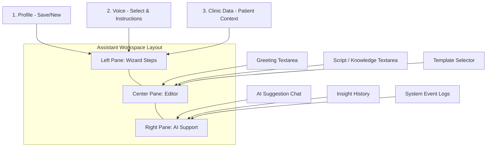
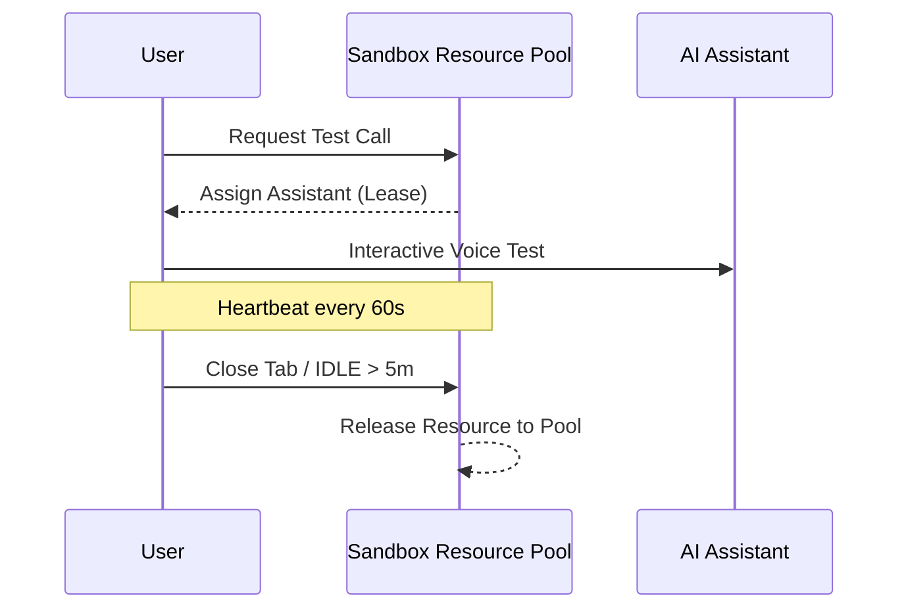

# LiquidVoice User Manual (Accurate Guide)

Welcome to **LiquidVoice**. This manual is designed to help you navigate the platform's actual interface and understand its core features.

---

## 1. Dashboard Overview
The Dashboard provides a bird's-eye view of your clinic's AI performance.

### Key Metrics:
- **Active Assistants**: Real-time count of live AI configurations.
- **Minutes Used**: Total usage tracked for billing.
- **Pending Costs**: Estimated cost at **$0.03/min**.
- **Success Rate**: Performance analytics for call completions.

---

## 2. Assistant Workspace
The Assistant Workspace uses a structured **3-Pane Layout** to make assistant configuration efficient and intuitive.

### How to Build Your Assistant:
1.  **Step 1: Profile**: Use the Left Pane to manage your assistant profiles (New/Save).
2.  **Step 2: Voice**: Select your AI voice provider (Telnyx/ElevenLabs) and set the **System Instructions**.
3.  **Step 3: Clinic Data**: Input specific knowledge like clinic hours, services, and FHIR patient data.
4.  **The Editor (Center)**: 
    - **Greeting**: Write what the AI says first.
    - **Script**: Define the flow of the conversation. Use **Templates** to get started quickly.
5.  **AI Assistant (Right)**: Use the chat to ask the AI to "Suggest" improvements to your script. You can **Preview** and **Apply** changes directly.

---

## 3. Multi-User Sandbox Pool
LiquidVoice features a shared pool of AI resources. This allows multiple users to test concurrently.

### Testing Your Assistant:
1.  Click the **"Test Assistant"** (or "Start Test Call") button.
2.  **Leasing**: The system "leases" a resource from the shared pool for your session.
3.  **Heartbeat**: Your browser maintains the lease every 60 seconds.
4.  **Auto-Release**: Sessions are automatically released after 5 minutes of inactivity to ensure others can use the pool.

---

## 4. Call Logs & Billing
Review every conversation in the **Logs** section to monitor quality and spend.

### Calculation Logic:
- **Base Rate**: $0.03 per minute.
- **Granularity**: Calculated per second ($0.0005/sec).
- **Details**: Every log includes Assistant Name, Patient ID, exact Duration, and Final Cost.

---

> [!IMPORTANT]
> **Privacy & Security**: All data is partitioned by your **Organization ID (OrgId)**. Your scripts and patient data are never shared with other clinics using the same sandbox pool.

