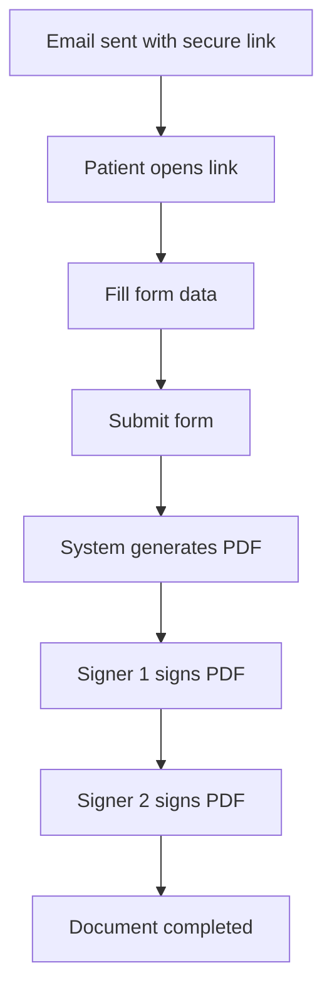
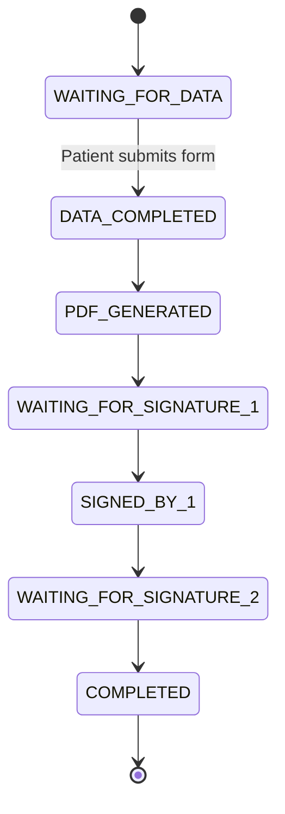
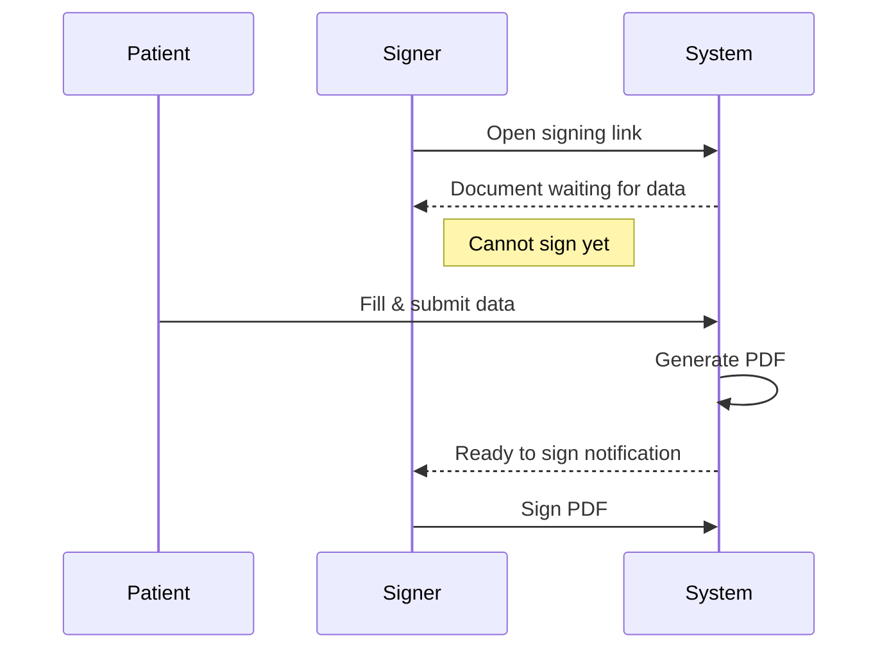
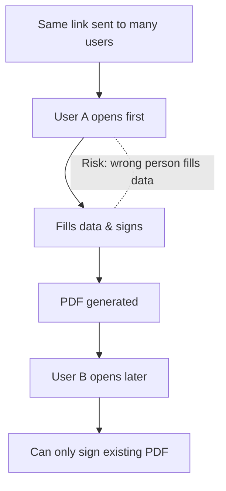

# eForm Workflow – Fill Data then Sign

## Overview
This document explains how the eForm system handles **multiple recipients**, ensuring that:
- Data is filled **once and only once**
- PDF is generated **after data completion**
- Signatures happen **in the correct order**

This approach avoids data conflicts and is suitable for **medical, legal, and business workflows**.

---

## Recommended Approach – Role-Based Workflow

### Roles
- **Data Filler** (e.g. Patient)
- **Signer 1** (e.g. Doctor)
- **Signer 2** (e.g. Witness / Admin)

Only the **Data Filler** can enter data. Signers must wait until the PDF is generated.

---

## Business Flow Diagram (Customer-Friendly)

---

## Status-Based Workflow (System View)

---

## What Happens If a Signer Opens the Link Too Early

---

## Not Recommended – First Click Wins

This approach is shown only to explain **why it is not allowed**.

---

## Key Message for Customers

> “In our system, data must be completed before signing.
> Therefore, we define **who fills the data** and **who signs**.
> Signers will automatically wait until the PDF is ready.”

---

## Benefits

- Clear responsibility
- No data conflicts
- Audit & compliance friendly
- Predictable signing order
- Better user experience

---

_End of document_

