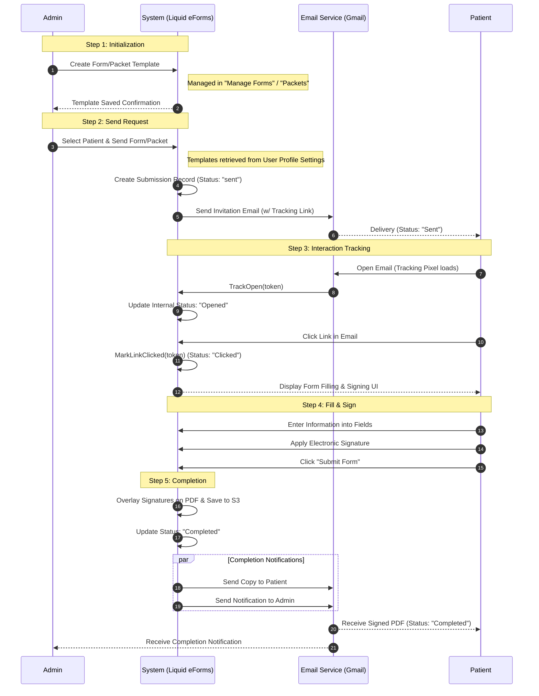

# eForm Workflow (Sequence Diagram)

This sequence diagram illustrates the detailed steps from creating a form/packet to email delivery, patient interaction (opening, clicking), and final signing and completion, including the corresponding email/submission statuses.

### 1. Where are Email Templates Configured?
Email templates (Subject and Body) are retrieved from the **User Profile Settings**.
- **Setting Screen**: Go to `User Management` -> `Edit User` -> `Messages` tab.
- **Fields**: `Email Invitation Subject` and `Email Invitation Body`.
- **Shortcodes**: You can use shortcodes like `[ClientName]`, `[FormName]`, `[BusinessName]`, and `[Link]` to personalize the content.

### 2. Detailed Actor Actions

#### **Admin (Administrator/Clinic Staff)**
- **Create Form/Packet**: Designs the digital form using the Form Builder or groups forms into a Packet.
- **Configure Settings**: Sets up the clinic's preferred email wording and reply-to address in the user management panel.
- **Initiate Sending**: Selects a patient from the database, chooses the relevant form/packet, and triggers the send action.
- **Monitor Progress**: Views the submission dashboard to see if the patient has opened or clicked the link.

#### **System (Liquid eForms)**
- **Generate Token**: Creates a unique `UniqueToken` for each submission to track individual patient progress.
- **Personalize Content**: Replaces shortcodes in the template with actual patient and clinic data.
- **Track Interaction**: Records the exact timestamp when the tracking pixel is loaded (Opened) and when the link is clicked (Clicked).
- **Process Completion**: Merges captured data and signatures into the final PDF document and stores it securely.

#### **Patient**
- **Receive & Open**: Checks their inbox and reads the invitation.
- **Access Form**: Clicks the secure link, which bypasses the need for a login (using the unique token).
- **Data Entry**: Fills out required medical history, consent, or demographic fields.
- **Electronic Signature**: Draws or types their signature directly on the screen.
- **Submission**: Finalizes the process, triggering the generation of their signed document copy.

### 3. Email/Submission Statuses Summary

| Status | Description |
| :--- | :--- |
| **Sent** | The system has initiated the delivery and forwarded it via the Gmail service. |
| **Opened** | The patient has opened the email (recorded via a 1x1 tracking pixel). |
| **Clicked** | The patient has clicked the link in the email to view the form. |
| **Completed** | The patient has successfully filled, signed, and submitted the form. |

### Technical Components:
- **Controllers**: `PacketsController`, `FormsController`, `SubmissionController`, `HomeController`.
- **Services**: `DatabaseService`, `GoogleAPI` (Email delivery), `S3Service` (PDF storage).
- **Tracking**: Uses a `UniqueToken` to identify each delivery instance and monitor user behavior.
